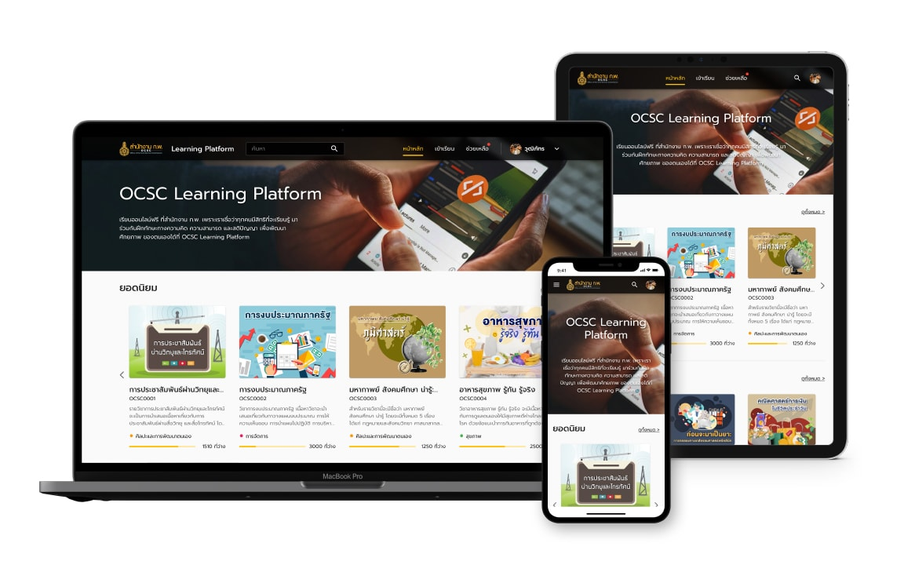

## Web Application: OCSC Learning Platform

Develop an e-Learning platform for the Office of the Civil Service Commission (OCSC). Students which are more than 200k government personnel can learn in an online, accessible, and adaptive learning environment. Developed by using TypeScript, ReactJS, Material-UI, .NET Core, MariaDB, and many more.
